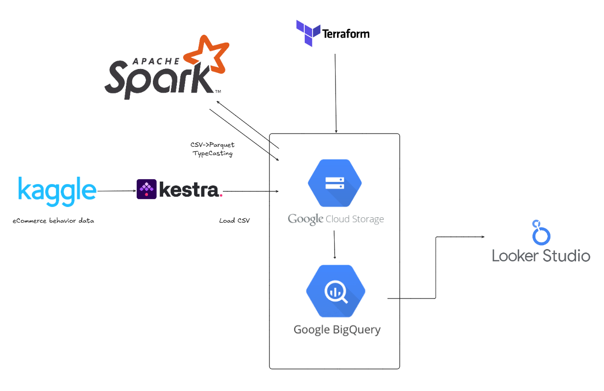

## 개요
이 프로젝트는 이커머스 클릭스트림 데이터를 분석하여 비즈니스 인사이트를 도출하는 데이터 엔지니어링 파이프라인을 구축합니다. 이벤트 로그를 수집·처리·분석하여 구매 전환 패턴, 상품 관심도, 사용자 여정을 파악하고 마케팅 및 UX 개선을 지원합니다.

## 해결하려는 문제
이커머스 비즈니스에서 "사람들이 상품을 보기는 하는데 왜 안 사지?"라는 핵심 질문에 답합니다.

**view → cart → purchase** 전환 퍼널을 분석하여:
- 카테고리/브랜드별 전환율 파악 → 마케팅 예산 집중 대상 식별
- 장바구니 이탈 상품 파악 → 리타겟팅 대상 선정
- 월별 전환율 추이 → 프로모션 효과 측정

## 📌 프로젝트 목표
현대적인 클라우드 및 오픈소스 도구를 활용하여 클릭스트림 분석을 위한 엔드투엔드 파이프라인을 구축합니다.

### ✅ 기술적 목표
- **Terraform**: GCP 리소스 자동 프로비저닝
- **Airflow**: 데이터 수집 및 처리 워크플로우 오케스트레이션
- **Apache Spark**: 대용량 데이터셋 처리 및 변환 (SparkSubmitOperator)
- **BigQuery**: 데이터 웨어하우스 적재
- **dbt**: 전환 퍼널 데이터 모델링 및 변환
- **Looker Studio**: 대시보드 시각화

## 기술 스택
| 영역 | 기술 |
|------|------|
| 클라우드 | Google Cloud Platform (GCP) |
| 인프라 | Terraform |
| 오케스트레이션 | Apache Airflow |
| 데이터 처리 | Apache Spark (Standalone 클러스터) |
| 데이터 웨어하우스 | BigQuery |
| 데이터 모델링 | dbt (dbt-bigquery) |
| 스토리지 | Google Cloud Storage |
| 시각화 | Looker Studio |

## 파이프라인 흐름
```
Kaggle API → GCS (raw/kaggle/) → Spark 변환 → GCS (processed/) → BigQuery → dbt → Looker Studio
```

## dbt 모델 구조
전환 퍼널 분석에 초점을 맞춘 3단계 모델링:

```
sources
  └── clickstream_partitioned_clustered   (BigQuery 원본)

staging
  └── stg_clickstream                     (정제: NULL 제거, event_type 필터)

marts
  ├── fct_funnel_events                   (세션+상품 단위 view/cart/purchase 도달 여부)
  └── mart_funnel                         (카테고리/브랜드/월별 전환율 집계 → Looker Studio)
```

## 폴더 구조
```
clickstream-pipeline/
├── airflow/             # Airflow DAG 및 Docker 설정
│   ├── Dockerfile
│   ├── docker-compose.yaml
│   ├── .env.example
│   └── dags/
│       └── clickstream_pipeline.py
├── spark/               # Spark 작업
│   ├── Dockerfile.spark
│   └── jobs/
│       └── csv_parquet_job.py
├── BigQuery/            # BigQuery 인프라 SQL (외부 테이블, 파티션 테이블 생성)
├── dbt/                 # dbt 데이터 모델링
│   ├── dbt_project.yml
│   ├── profiles.yml
│   └── models/
│       ├── staging/
│       │   ├── sources.yml
│       │   ├── stg_clickstream.sql
│       │   └── schema.yml
│       └── marts/
│           ├── fct_funnel_events.sql
│           ├── mart_funnel.sql
│           └── schema.yml
├── data/                # 원본 데이터
├── terraform/           # 인프라 코드
└── images/
```

## 실행 방법

### 0) 사전 준비
```bash
cd airflow
cp .env.example .env
# .env 파일에 Kaggle API 키 및 GCP 설정 입력
```

### 1) 인프라 프로비저닝 (Terraform)
```bash
cd terraform
terraform init
terraform plan
terraform apply
```
- 서비스 계정 키를 `cred/clickstream-sa.json`에 배치합니다.
- `terraform/variables.tf` 또는 `*.tfvars`에서 변수를 조정하세요.

### 2) Airflow + Spark 실행
```bash
cd airflow
docker compose up airflow-init   # 최초 1회: DB 초기화 및 계정 생성
docker compose up -d             # 전체 스택 기동
```

| 서비스 | URL |
|--------|-----|
| Airflow UI | http://localhost:8080 (admin / admin) |
| Spark Master UI | http://localhost:8081 |

### 3) DAG 실행
- Airflow UI에서 `clickstream_pipeline` DAG을 활성화하고 **Trigger DAG** 실행
- 실행 순서: Kaggle 다운로드 → GCS 업로드 → Spark 변환 (10월, 11월 병렬)

### 4) BigQuery 테이블 생성
`BigQuery/` 폴더의 SQL을 순서대로 실행합니다:
```
1. create_external_table.sql
2. created_partitioned_clustered_table.sql
```

### 5) dbt 실행
```bash
cd dbt
source .venv/bin/activate
dbt run --profiles-dir .   # 모델 실행
dbt test --profiles-dir .  # 데이터 품질 테스트
```

| 생성 테이블 (clickstream_dbt 데이터셋) | 설명 |
|--------------------------------------|------|
| `stg_clickstream` | 정제된 이벤트 뷰 |
| `fct_funnel_events` | 세션별 퍼널 도달 여부 |
| `mart_funnel` | 전환율 집계 (Looker Studio 연결용) |

### 6) 시각화 (Looker Studio)
- BigQuery `clickstream_dbt.mart_funnel` 테이블을 Looker Studio에 연결하여 대시보드를 구성합니다.

## 아키텍처


## Looker Studio 데이터 시각화


## 참고 자료
- 데이터셋: [E-commerce Behavior Data (2019 Oct/Nov)](https://www.kaggle.com/datasets/mkechinov/ecommerce-behavior-data-from-multi-category-store?select=2019-Oct.csv)
