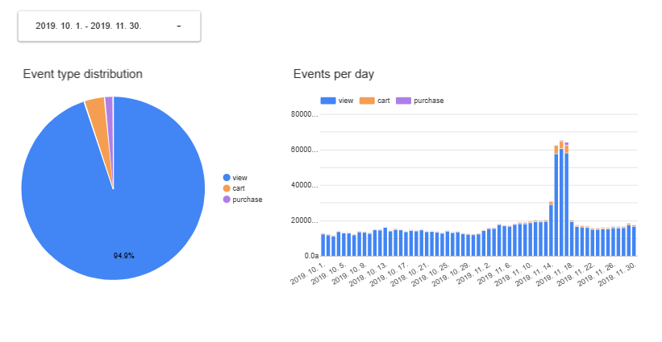

## Overview
This project builds a data engineering pipeline that analyzes e-commerce clickstream data to derive business insights. It collects, processes, and analyzes event logs to understand purchase conversion patterns, product interest, and user journeys, supporting marketing and UX improvements.

## Problems Addressed
- Identify user purchase journeys and drop-off points
- Analyze view/cart/purchase conversion rates by product
- Detect time-based traffic patterns and peak hours
- Track user interest by category/brand
- Session-based behavior analysis

## 📌 Project Goals
Build an end-to-end pipeline for clickstream analytics using modern cloud and open-source tools.

### ✅ Technical Goals
- **Terraform**: Provision GCP resources automatically
- **Kestra**: Orchestrate data ingestion workflows
- **Apache Spark**: Process and transform large datasets
- **BigQuery**: Load and analyze warehouse data
- **Looker Studio**: Visualize dashboards

## Tech Stack
| Area | Technology |
|------|------------|
| Cloud | Google Cloud Platform (GCP) |
| Infrastructure | Terraform |
| Orchestration | Kestra |
| Data Processing | Apache Spark |
| Data Warehouse | BigQuery |
| Storage | Google Cloud Storage |
| Visualization | Looker Studio |

## Analysis Summary (BigQuery)
Based on `BigQuery/clickstream_analysis.sql`:

- Periodic (hourly) event-type distribution: `event_type_by_hour`
- Visualization use: donut/line charts to show hourly event ratios and trends

For details, see `BigQuery/README.md`.

## Folder Structure
```
clickstream-pipeline/
├── data/        # Raw data
├── spark/       # Spark jobs
├── kestra/      # Workflow definitions
└── terraform/   # Infrastructure code
```

## How to Run

### 1) Provision Infrastructure (Terraform)
```bash
cd terraform
terraform init
terraform plan
terraform apply
```
- The service account key path uses `cred/clickstream-sa.json` in `terraform/main.tf`.
- Adjust variables in `terraform/variables.tf` or with `*.tfvars`.

### 2) Configure and Run Kestra
- Register KV/Secret values and upload flows (see `kestra/README.md`).
- Enable flows in the Kestra UI and run with inputs as needed.

### 3) Run Spark Processing
- Follow the execution steps in `spark/README.md`.

### 4) Load and Analyze in BigQuery
- Load Parquet outputs into BigQuery and run queries.
- See `BigQuery/README.md` for details.

### 5) Visualization (Looker Studio)
- Connect BigQuery tables to Looker Studio and build dashboards.

## Architecture

## Data Visualization with Looker Studio


## Why Not (Yet)
- **Why dbt is not used**: With only one analytics table, adding dbt felt unnecessary. It can be added later in `dbt/` if modeling expands.
- **Why Spark jobs are not run via Kestra**: There wasn’t enough reliable reference material to build a stable Kestra–Spark integration in the current environment. Spark orchestration is planned for a future Airflow project.

## References
- Dataset: [E-commerce Behavior Data (2019 Oct/Nov)](https://www.kaggle.com/datasets/mkechinov/ecommerce-behavior-data-from-multi-category-store?select=2019-Oct.csv)
