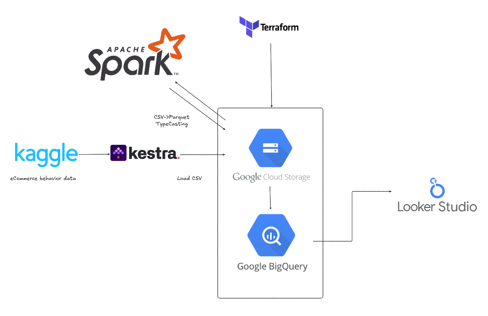
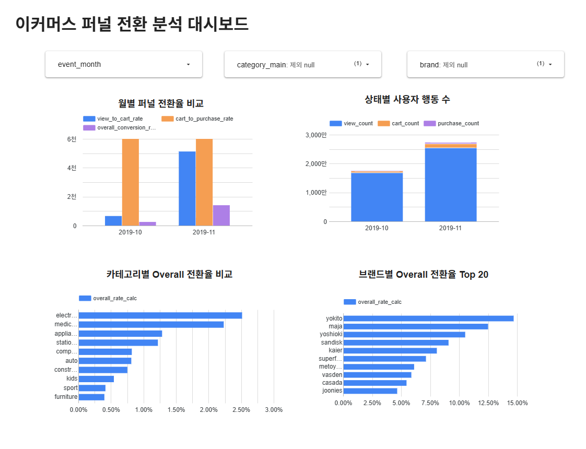
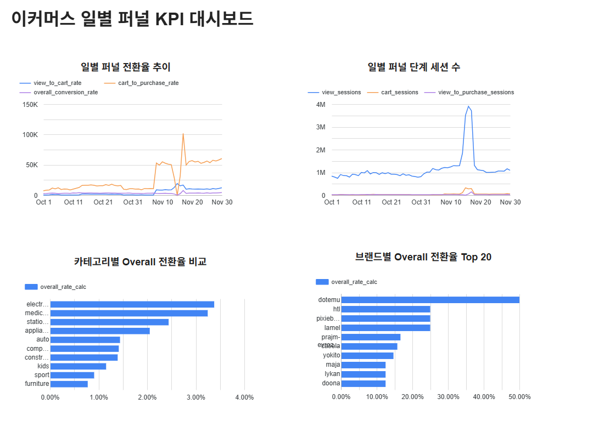
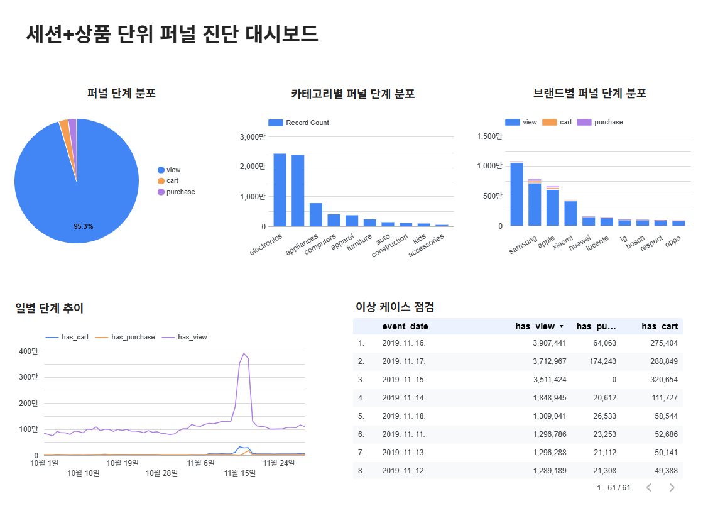

# Clickstream Conversion Funnel Pipeline

An end-to-end data engineering pipeline that ingests e-commerce clickstream events, transforms them with Apache Spark on Dataproc, loads them into BigQuery, models them with dbt, and visualises conversion-funnel KPIs in Looker Studio.

---

## Problem Description

E-commerce businesses often observe that traffic grows while purchase conversion does not scale proportionally. The core question this project answers is:

> **"People view products — why aren't they buying?"**

By decomposing the user journey into a **view → cart → purchase** funnel, we can:

- Identify which categories and brands have the lowest conversion rates → prioritise marketing spend
- Find products with high cart-abandonment rates → create retargeting audiences
- Track monthly conversion trends → measure the effect of promotions

Without a reliable, consistently-defined pipeline these questions are impossible to answer at scale. Raw event logs have quality issues (bad types, nulls, mixed UTC formatting) that must be handled before any analysis.

---

## Architecture

```
Kaggle API
    ↓  (clickstream_ingest_raw DAG)
GCS  raw/kaggle/
    ↓  (clickstream_spark_transform DAG — Dataproc)
GCS  processed/clickstream/  (Parquet, Snappy, partitioned)
    ↓  (clickstream_pipeline DAG)
BigQuery  external table  →  partitioned + clustered table
    ↓
dbt  stg_clickstream  →  fct_funnel_events  →  mart_funnel / mart_daily_funnel_kpi
    ↓
Looker Studio Dashboard
```



---

## Tech Stack

| Layer | Technology |
|-------|-----------|
| Cloud | Google Cloud Platform (GCP) |
| Infrastructure as Code | Terraform |
| Orchestration | Apache Airflow 2.9 |
| Data Processing | Apache Spark 3.5 (Dataproc) |
| Data Warehouse | BigQuery |
| Data Modelling | dbt (dbt-bigquery 1.8) |
| Storage | Google Cloud Storage |
| Visualisation | Looker Studio |
| CI | GitHub Actions |

---

## Cloud & Infrastructure (IaC)

All GCP resources are provisioned with **Terraform**:

- **GCS bucket** — versioning, lifecycle rules, uniform bucket-level access
- **BigQuery dataset** — `clickstream` dataset in the project

```bash
cd terraform
terraform init
terraform plan
terraform apply
```

Place the GCP service-account key at `cred/clickstream-sa.json` before running Terraform or Airflow.

---

## Data Ingestion — Airflow Batch Pipeline

Three Airflow DAGs handle the end-to-end pipeline. Each DAG sends a **Slack webhook** alert on failure.

### DAG 1 — `clickstream_ingest_raw`
Downloads the [Kaggle dataset](https://www.kaggle.com/datasets/mkechinov/ecommerce-behavior-data-from-multi-category-store), unzips it, and uploads the CSV files to `gs://<bucket>/raw/kaggle/`.

| Task | Operator | Description |
|------|----------|-------------|
| `download_kaggle_dataset` | BashOperator | `kaggle datasets download …` |
| `unzip_dataset` | PythonOperator | Extracts zip to `/tmp/clickstream_raw/extracted/` |
| `upload_csvs_to_gcs` | PythonOperator | Uploads every `.csv` to GCS `raw/kaggle/` |

### DAG 2 — `clickstream_spark_transform`
Uploads the PySpark job to GCS, then submits two sequential Dataproc jobs (October and November).

| Task | Description |
|------|-------------|
| `upload_spark_job_to_gcs` | Copies `csv_parquet_job.py` → `gs://<bucket>/code/` |
| `spark_csv_to_parquet_oct` | Dataproc job for 2019-10 data |
| `spark_csv_to_parquet_nov` | Dataproc job for 2019-11 data |

`max_active_runs=1` prevents concurrent Dataproc clusters from racing.

### DAG 3 — `clickstream_pipeline`
Creates BigQuery tables and runs dbt.

| Task | Description |
|------|-------------|
| `create_bigquery_tables` | Runs three SQL files via BigQuery Python client |
| `dbt_run` | `dbt run` for all models |
| `dbt_test` | `dbt test` for data quality checks |

---

## Spark Transformation Logic

`spark/jobs/csv_parquet_job.py` implements a **Bronze → Processed** quality pipeline:

1. **Bronze load** — read raw CSV with an all-string schema to avoid silent data loss.
2. **Type casting** — cast `event_time`, `product_id`, `category_id`, `price`, `user_id` to their target types; keep original `*_raw` columns alongside `*_typed` results.
3. **Cast-failure detection** — rows where a raw value is present but the typed value is NULL are flagged; `failure_reason` lists the failing column names.
4. **Processed filter** — keep only rows where `event_time`, `user_id`, and `product_id` are all valid.
5. **Schema enforcement** — re-apply the declared `processed_schema()` to prevent schema drift.
6. **Partition columns** — derive `event_date`, `event_month`, `event_month_date` from UTC `event_time`.
7. **Idempotent write** — delete the target `event_month` partition, then append-write Parquet (Snappy compression), partitioned by `event_month` / `event_date`.

---

## Data Warehouse — BigQuery

Three SQL files create the BigQuery table hierarchy:

| SQL File | Purpose |
|----------|---------|
| `create_external_table.sql` | External table pointing to GCS Parquet files |
| `create_partitioned_table.sql` | Partitioned table (by `event_date`) |
| `create_partitioned_clustered_table.sql` | Partitioned by `event_date` **+ clustered** by `event_type`, `category_code`, `brand` |

The **clustered table** is the primary analytical source; clustering on the most-queried filter columns significantly reduces scan bytes and cost.

---

## Transformations — dbt Models

```
sources
  └── clickstream_partitioned_clustered   (BigQuery raw source)

staging
  └── stg_clickstream                     (clean: filter NULLs, filter event_type, extract category_main)

marts
  ├── fct_funnel_events                   (session + product-level view/cart/purchase flags)
  ├── mart_funnel                         (category/brand/month conversion rates — Looker Studio)
  └── mart_daily_funnel_kpi               (daily KPI aggregation — monitoring)
```

### Conversion KPIs (consistent-population definition)

| Metric | Formula |
|--------|---------|
| `view_to_cart_rate` | `cart_sessions / view_sessions × 100` |
| `cart_to_purchase_rate` | `cart_to_purchase_sessions / cart_sessions × 100` |
| `overall_conversion_rate` | `view_to_purchase_sessions / view_sessions × 100` |

Numerator and denominator always use the **same cohort** so rates stay in 0–100%.

dbt contracts (`enforced: true`) and tests (`not_null`, `accepted_values`) guard schema and data quality.

---

## Dashboard — Looker Studio

Connect Looker Studio to the `clickstream_dbt` BigQuery dataset.

### Tile 1 — `mart_funnel` (monthly/category/brand conversion comparison)
- Time-series of `view_to_cart_rate`, `cart_to_purchase_rate`, `overall_conversion_rate`
- Bar chart of conversion rates by `category_main` and `brand`



### Tile 2 — `mart_daily_funnel_kpi` (daily KPI monitoring)
- Daily conversion rate trend
- Daily session volume trend (`view_sessions`, `cart_sessions`)



### Supplementary — `fct_funnel_events` (session-level funnel diagnosis)
- `funnel_stage` distribution (donut / bar)
- Category-level stacked bar + detail table



---

## Reproducibility — Step-by-Step

### Prerequisites
- GCP project with billing enabled
- Service-account JSON key at `cred/clickstream-sa.json` (roles: Storage Admin, BigQuery Admin, Dataproc Admin)
- Kaggle API credentials
- Docker & Docker Compose
- Terraform ≥ 1.5

### 0) Configure environment
```bash
cd airflow
cp .env.example .env
# Fill in KAGGLE_USERNAME, KAGGLE_KEY, GCP_PROJECT_ID, GCP_BUCKET_NAME, SLACK_WEBHOOK_URL
```

### 1) Provision infrastructure (Terraform)
```bash
cd terraform
terraform init
terraform plan
terraform apply
```

### 2) Start Airflow + Spark
```bash
cd airflow
docker compose up airflow-init   # first run only: DB init and account creation
docker compose up -d
```

| Service | URL |
|---------|-----|
| Airflow UI | http://localhost:8080 (admin / admin) |
| Spark Master UI | http://localhost:8081 |

### 3) Run the pipeline DAGs (in order)

1. Trigger `clickstream_ingest_raw` — downloads and uploads raw CSVs to GCS
2. Trigger `clickstream_spark_transform` — converts CSVs to Parquet on Dataproc
3. Trigger `clickstream_pipeline` — creates BigQuery tables and runs dbt

### 4) Verify BigQuery tables
After step 3 the following tables should exist in the `clickstream` dataset:
- `clickstream_external`
- `clickstream_partitioned`
- `clickstream_partitioned_clustered`

And in `clickstream_dbt`:
- `stg_clickstream`
- `fct_funnel_events`
- `mart_funnel`
- `mart_daily_funnel_kpi`

### 5) Connect Looker Studio
Open [Looker Studio](https://lookerstudio.google.com), add a BigQuery data source, and select the tables above.

---

## Testing & CI

| Suite | Tool | Status |
|-------|------|--------|
| Unit — DAG structure | pytest + Airflow | ✅ implemented |
| Unit — Spark functions | pytest + PySpark | ✅ implemented |
| Integration — Spark E2E | pytest + PySpark | ✅ implemented |
| dbt tests | dbt test | ✅ implemented |
| Load tests | pytest | ⏳ TODO (skipped) |
| Resilience tests | pytest | ⏳ TODO (skipped) |
| Performance benchmarks | pytest | ⏳ TODO (skipped) |

GitHub Actions CI runs lint, Spark unit tests, DAG tests, and integration tests on every push.

---

## Dataset

[E-Commerce Behavior Data from Multi-Category Store (2019 Oct/Nov)](https://www.kaggle.com/datasets/mkechinov/ecommerce-behavior-data-from-multi-category-store?select=2019-Oct.csv)

~109M events across view, cart, and purchase event types.
